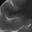
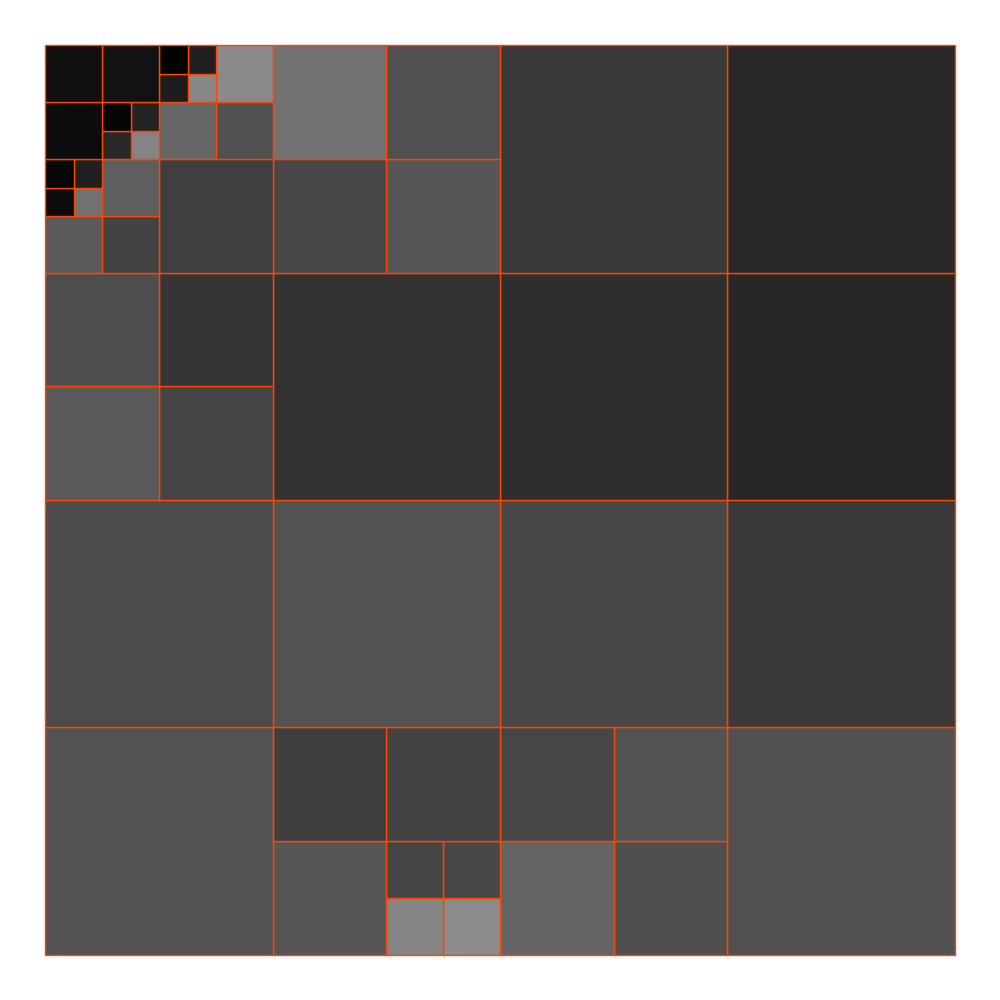
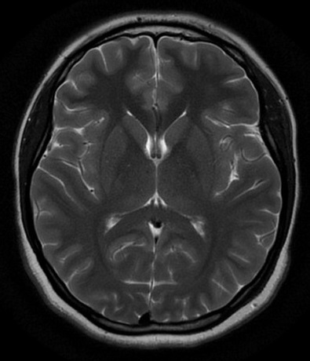
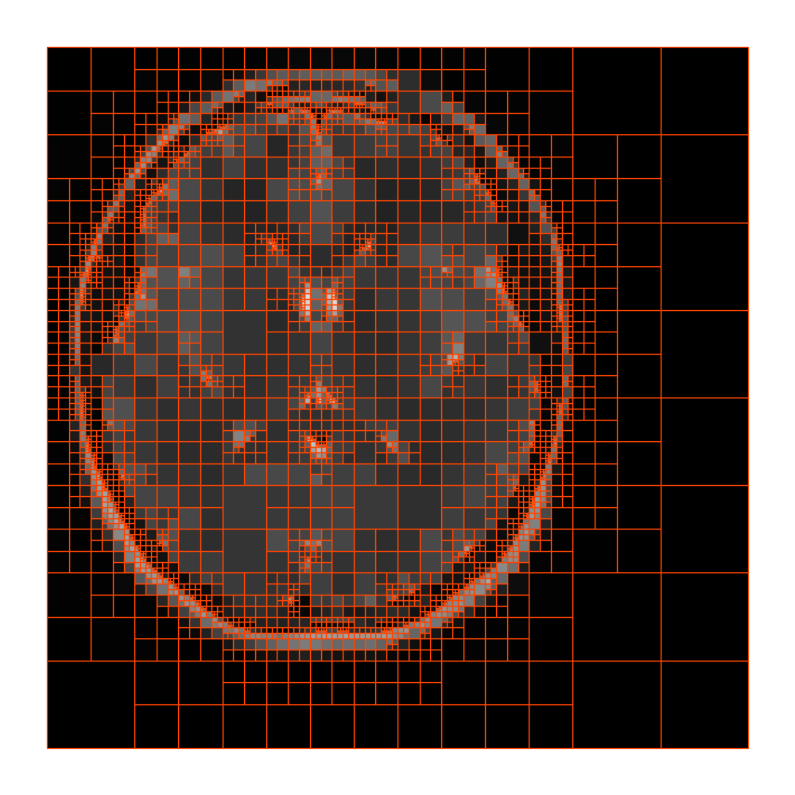
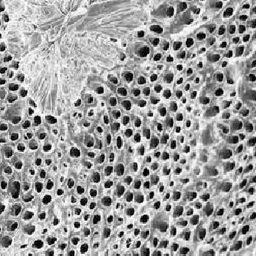
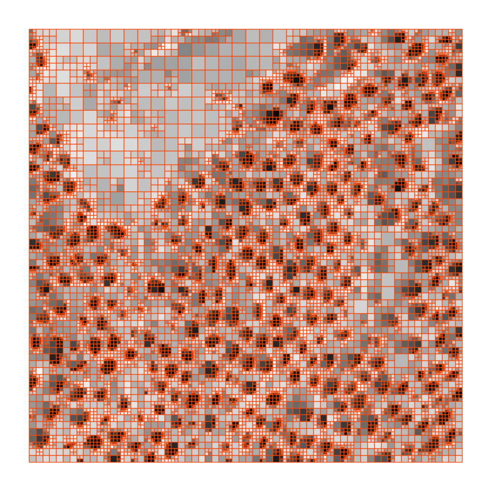
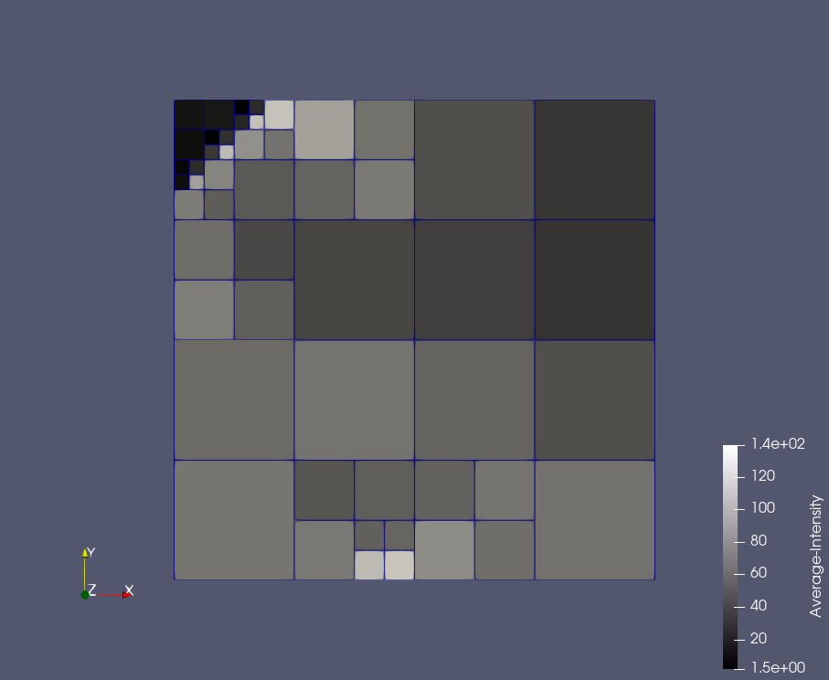
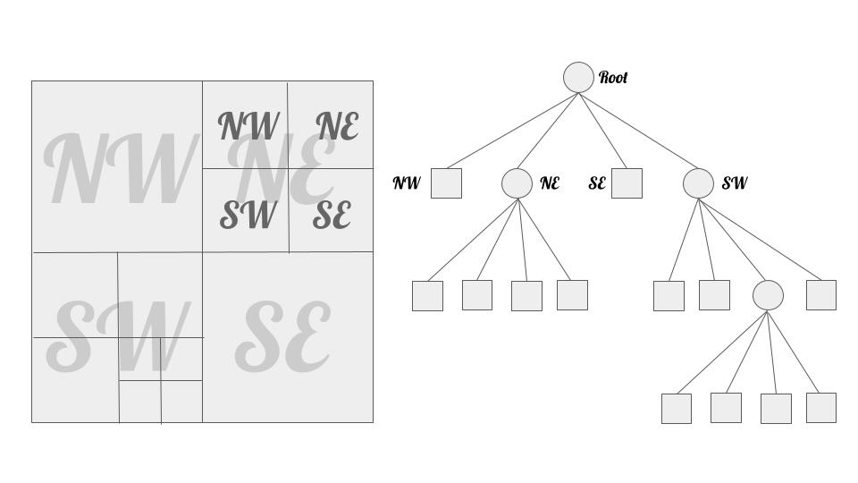
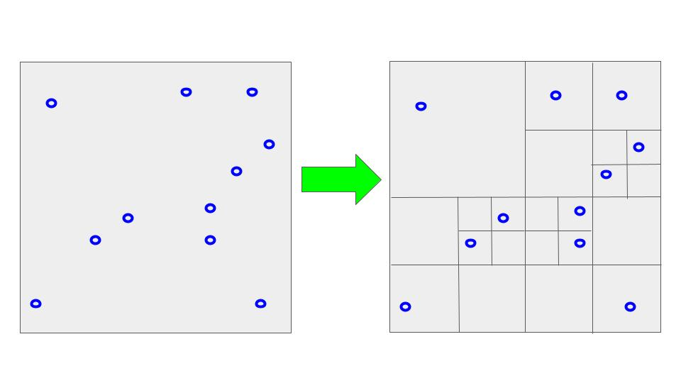
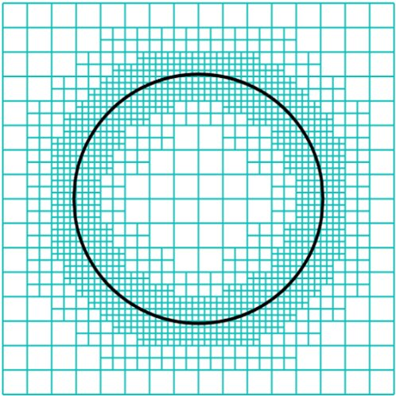

<a name="readme-top"></a>

<!-- PROJECT SHIELDS -->

[![Contributors][contributors-shield]][contributors-url]
[![Forks][forks-shield]][forks-url]
[![Stargazers][stars-shield]][stars-url]
[![Issues][issues-shield]][issues-url]
[![MIT License][license-shield]][license-url]
[![LinkedIn][linkedin-shield]][linkedin-url]
[![Made with love in SUT (Iran)][sut-badge]][sut-add]
[](https://doi.org/10.5281/zenodo.8373702)
[](https://pepy.tech/project/qtreemesh)
[](https://pepy.tech/project/qtreemesh)


<!-- PROJECT LOGO -->
<br />
<div align="center">
  <a href="https://github.com/Sad-Abd/qtreemesh">
    
  </a>

<h3 align="center">QTREEMESH</h3>

  <p align="center">
    Generation of QuadTree mesh from an image
    <br />
    <a href="https://github.com/Sad-Abd/qtreemesh"><strong>Explore the docs »</strong></a>
    <br />
    <br />
    <a href="https://github.com/Sad-Abd/qtreemesh">View Demo</a>
    ·
    <a href="https://github.com/Sad-Abd/qtreemesh/issues">Report Bug</a>
    ·
    <a href="https://github.com/Sad-Abd/qtreemesh/issues">Request Feature</a>
  </p>
</div>


<!-- TABLE OF CONTENTS -->
<details>
  <summary>Table of Contents</summary>
  <ol>
    <li>
      <a href="#about-the-project">About The Project</a>
    </li>
    <li>
      <a href="#getting-started">Getting Started</a>
      <ul>
        <li><a href="#installation">Installation</a></li>
      </ul>
    </li>
    <li><a href="#usage">Usage</a>
      <ol>
        <li><a href="#1-read-image">Read Image</a></li>
        <li><a href="#2-preprocessing">Preprocessing</a></li>
        <li><a href="#3-quadtree-algorithm">QuadTree Algorithm</a></li>
        <li><a href="#4-mesh-generation">Mesh Generation</a></li>
        <li><a href="#5-export-and-implementation">Export and Implementation</a></li>
        <li><a href="#6-pixel-lookup-and-per-cell-labels">Pixel Lookup and Per-Cell Labels</a></li>
        <li><a href="#7-sbfem-analysis">SBFEM Analysis</a></li>
      </ol>
    </li>
    <li><a href="#theoretical-explanation">Theoretical Explanation</a></li>
    <li><a href="#roadmap">Roadmap</a></li>
    <li><a href="#contributing">Contributing</a></li>
    <li><a href="#license">License</a></li>
    <li><a href="#contact">Contact</a></li>
    <li><a href="#acknowledgments">Acknowledgments</a></li>
  </ol>
</details>


<!-- ABOUT THE PROJECT -->
## About The Project

<!--[![Product Name Screen Shot][product-screenshot]](https://example.com)-->

QTREEMESH is a python package that can create a [Quadtree](https://en.wikipedia.org/wiki/Quadtree) structure from an image. This tree data structure can also be converted to mesh structure that can be used in different areas of science, e.g. finite element analysis. The Quadtree algorithm in this package is based on pixels' intensity. For more information about this algorithm, please refer to <a href="#theoretical-explanation">Theoretical Explanation</a> section of this doc.


<p align="right">(<a href="#readme-top">back to top</a>)</p>


<!--
### Built With

[![python][python]](https://www.python.org)

<p align="right">(<a href="#readme-top">back to top</a>)</p>
-->


<!-- GETTING STARTED -->
## Getting Started

This part explains how to install and use this package.

### Installation
Install `QTREEMESH` from PyPI via pip.
```sh
pip install qtreemesh
```


<p align="right">(<a href="#readme-top">back to top</a>)</p>


<!-- USAGE EXAMPLES -->
## Usage

There is a `test.py` file in `examples` folder that demonstrate how different parts of this package work. The `examples` folder also contains a `solidpy` folder showing how to export a generated mesh to the open-source finite element code [SolidsPy](https://github.com/AppliedMechanics-EAFIT/SolidsPy). Here we go through `test.py` line by line:

### 1. Read Image

First we import required tools from other libraries
```python
from PIL import Image # to read image file properly
from numpy import asarray # for converting image matrix to array
```

Then we read the image and convert it to gray-scale. There are several example images in `examples` folder. `4.jpg` is smaller than the others and needs fewer computation efforts.
```python
im = Image.open("4.jpg").convert('L')
```

### 2. Preprocessing

The quadtree algorithm is most efficient when the image is square and the number of its pixels is an integer power of 2, i.e. $2^n$. There is a function `image_preprocess()` dedicated to the modification of the original image by padding it with zero intensity pixels and satisfying the mentioned requirement:
```python
from qtreemesh import image_preprocess

imar = image_preprocess(asarray(im))
```

### 3. QuadTree Algorithm

The QuadTree decomposition can be performed on `image_array` using a recursive class `QTree` based on given `crit` (tolerance).
```python
from qtreemesh import QTree

quad = QTree(None, imar, 125) # QTree(None, image_array, crit)
```
A cell splits only when the difference between its maximum and minimum pixel intensities is **strictly greater** than `crit`; with the default `crit = 1`, two regions whose intensities differ by exactly 1 are not split.

The preprocessing, quadtree and mesh-generation steps can be done in one call:
```python
mesh = QTreeMesh.from_image(asarray(im), crit=125)
```

For label maps (region indices rather than intensities) pass `label_mode=True`; every cell is then split until it holds exactly one label, and `element_labels()` is guaranteed to succeed:
```python
mesh = QTreeMesh.from_image(labels, label_mode=True)
```

To refine cells where the intensity changes steeply (edges, inclusion boundaries) while keeping flat regions coarse, pass `grad_crit`: a cell then also splits when the maximum difference between adjacent pixels inside it exceeds this value, even when the overall intensity range would not split it:
```python
mesh = QTreeMesh.from_image(asarray(im), crit=200, grad_crit=20)
```

`QTree` object may have 4 children `QTree` objects (can be accessed through attributes: `north_west`,
`north_east`,
`south_west`,
`south_east`) and so on. Each `QTree` has an attribute `divided` that determines the existence of children partitions. There are also an property method for counting `count_leaves` and a method for saving tree leaves `save_leaves` (i.e. undivided partitions).

Two further options are available in `QTree`:

- `scale` (default 1.0): the real length of each pixel edge. For example, when `scale = 2`, each pixel represents a 2×2 square part of the object; node coordinates are reported in these real units.
- `max_size` (default `None`): the maximum cell size in pixels. Cells whose side exceeds `max_size` are split even when their pixels are homogeneous, so a uniform region is not left as one huge cell (useful for analysis accuracy away from interfaces). Cells halve at each split, so the effective cell side is the largest power of 2 not exceeding `max_size`.
```python
quad = QTree(None, imar, 125, scale=2.0, max_size=32)
```

### 4. Mesh Generation
Common mesh data structure can be extracted from QuadTree structure using `QTreeMesh` class. After initiating the class, corresponding `elements` and `nodes` can be generated as attributes of the `QTreeMesh` object with the method `create_elements`. The resulted mesh may be illustrated using `draw` method. 
```python
from qtreemesh import QTreeMesh

mesh = QTreeMesh(quad)
mesh.create_elements()
mesh.draw(True, 'orangered') # mesh.draw(fill_inside, edge_color, save_name)
```

Each element in `elements` is a `QTreeElement` object that contains many attributes, e.g. element number : `number`, element nodes : `nodes_numbers`, element property (average of pixel intensities) : `element_property` and etc.

| Example   |      Image      |  Mesh |
|----------|:-------------:|:------:|
| 4.jpg |   |  |
| 5.jpg |       |    |
| 6.jpg |       |    |

For more examples, please refer to the files in the [`examples`](examples/) folder and to the docstrings of the package classes.

### 5. Export and Implementation

One can easily export generated mesh as `vtk` format using following line:
```python
mesh.vtk_export(filename = "4_meshed.vtk")
```
and the result can be viewed in visualization applications such as [ParaView](https://github.com/Kitware/ParaView):



It's worth mentioning that the method `vtk_export()` has no dependency to vtk related libraries and create `.vtk` file manually.

By default every element is exported as one polygon cell. With `mesh.vtk_export(filename, adjusted=True)` the elements are exported as treated for FEM — triangles and/or quadrilaterals with their proper VTK cell types (`force_triangulation` selects between the two, as in `adjust_mesh_for_FEM`). With `cell_data=True` the file additionally carries per-cell scalar arrays: the exact `Label` of the cell, its `Mode`, `Rotation` and `Size`, next to the averaged intensity.

It is also possible to adjust the elements to handle hanging nodes and generate a mesh that is either triangular or quadrilateral/triangular (based on templates available in [[2]] and [[3]]).:

```python
fem_nodes, fem_elements, fem_properties = mesh.adjust_mesh_for_FEM()
```
The default configuration generates FEM elements as triangles. To include both quadrilateral and triangle elements, set `force_triangulation` to `False`.

The edges that belong to a single element form the boundary of the mesh, and their endpoints give the boundary nodes — the natural place to apply boundary conditions in a solver:
```python
edges = mesh.boundary_edges()   # (node_1, node_2) pairs, 1-based
nodes = mesh.boundary_nodes()   # sorted 1-based node numbers
```

A complete working example of this pipeline — exporting a generated mesh as input files for [SolidsPy](https://github.com/AppliedMechanics-EAFIT/SolidsPy), running the analysis, and visualizing the results — is available in the [`examples/solidpy`](examples/solidpy/) folder.

### 6. Pixel Lookup and Per-Cell Labels

For label or multi-material images, the averaged `element_property` may be ambiguous. Two methods provide exact information instead:

```python
pixel_elem = mesh.pixel_to_element()  # (n, n) array: each pixel -> element number
labels = mesh.element_labels()        # exact label of each element
```

`pixel_elem[row, col]` holds the 1-based number of the element covering that pixel (row 0 is the top of the image), so `mesh.elements[pixel_elem[row, col] - 1]` is the element itself. `element_labels()` returns one label per element, aligned with `mesh.elements` — the single intensity shared by all pixels under the cell. It raises a `ValueError` when a cell spans multiple intensities (i.e. the mesh is not label-homogeneous); pass `strict=False` to get the minimum intensity under such cells instead.

`image_preprocess()` pads images to a square power of 2, and the mesh covers the padded region too. `mesh.trim_padding(rows, cols)` removes every element that lies entirely in the padded region, where `rows` and `cols` are the shape of the original image before padding. Cells straddling the boundary are kept, element and node numbers are unchanged, and `pixel_to_element()` reports 0 for padded pixels that no element covers.

<p align="right">(<a href="#readme-top">back to top</a>)</p>

### 7. SBFEM Analysis

The `qtreemesh.sbfem` subpackage performs linear static elastic analysis of a
quadtree mesh with the scaled boundary finite element method. Every mesh cell
is treated as an S-element; its condensed stiffness is obtained from the
condensed solution of its basic cell pattern (six patterns cover all balanced
quadtree cells), rotated to the cell orientation and scaled by the cell's
Young's modulus.

```python
from qtreemesh.sbfem import SBFEMModel

model = SBFEMModel(mesh, moduli={0: 1.0, 10: 5.0}, nu=0.45)
```

`moduli` is either a single Young's modulus or a mapping from the exact
per-cell labels (see `element_labels()`) to the modulus of each region;
`formulation` is `"plane_strain"` (default) or `"plane_stress"`. The model
provides:

- `stiffness()` — the sparse global stiffness matrix;
- `boundary_edges()` — the edges of the mesh that belong to one element;
- `traction_forces(edges, tractions)` — consistent nodal forces of constant
  tractions per edge;
- `solve(dirichlet, force=None)` — the static solution for nodal Dirichlet
  constraints `[node, direction, value]` (direction 1 = x, 2 = y), returning
  the displacement vector and the support reactions;
- `boundary_stress(u)` — the stress `[sigma_xx, sigma_yy, sigma_xy]` at the
  midpoint of every element edge, with the points returned alongside; rows
  follow the elements and, within an element, its edges;
- `field(element, edge, eta, xi, u)` — displacement and stress at an interior
  point of one element in its scaled boundary coordinates.

Stresses include the Young's modulus of their cell. In `field`, `edge` counts
the edges of the element's node list (edge `i` runs from node `i` to node
`i + 1`), `eta` in [-1, 1] runs along that edge and `xi` in (0, 1] is the
radial coordinate, from the scaling centre (0) to the element boundary (1).

`nu` must lie in (-1, 0.5) for plane strain and in (-1, 1) for plane stress,
and every modulus must be positive and finite. `solve` needs constraints that
remove both rigid translations and the rotation; a nonzero load with a free
rigid-body motion raises a `ValueError`.

A complete compression example:

```python
edges = model.boundary_edges()
top = [(a, b) for (a, b) in edges
       if mesh.nodes[a - 1, 1] == mesh.nodes[:, 1].max()
       and mesh.nodes[b - 1, 1] == mesh.nodes[:, 1].max()]
force = model.traction_forces(top, np.tile([0.0, 1.0], (len(top), 1)))

dirichlet = [[n, 2, 0.0] for (a, b) in edges
             for n in (a, b) if mesh.nodes[n - 1, 1] == 0.0]
dirichlet.append([min(n for n in {n for e in edges for n in e}
                      if mesh.nodes[n - 1, 1] == 0.0), 1, 0.0])

u, reactions = model.solve(np.array(dirichlet), force=force)
points, stress = model.boundary_stress(u)
```

The displacement formulation locks for nearly incompressible materials
(nu approaching 0.5).

<p align="right">(<a href="#readme-top">back to top</a>)</p>


## Theoretical Explanation

### Introduction

A __Quadtree__ is a special type of tree where each parent node has exactly four smaller nodes connected to it. Each square in the Quadtree is represented by a node. If a node has children, their squares are the four quadrants of its own square, which is why the tree is called a tree. This means that when you put the smaller squares of the leaves together, they make up the bigger square of the root. 



In this figure, labels _NW_, _NE_, _SE_, and _SW_ are representing different quadrants (North-West, North-East, South-East and South-West respectively).

While this algorithm has many applications in various fields of science (e.g., collision detection, image compression, etc.), this doc especially focuses on the mesh generation subject. There almost three major definition of problem:

1. **Points set problems:**

    In this case, there are a set of points $\{p_i\} : (x_i , y_i)$ (which can be interpreted as the position of objects), and we need to build the quadtree in such a way that every square contains at most $c$ point(s). First we consider the root square which contains all the points. Then we start recursively splitting squares until the criteria $n_p \le c$ met. In following figure, the quadtree of 11 points with $c = 1$ is illustrated:

    

    There are many different implementations of this variation of algorithm, for example in [Python](https://www.geeksforgeeks.org/quad-tree/), 
    [C++](https://lisyarus.github.io/blog/programming/2022/12/21/quadtrees.html), and 
    [C#](https://github.com/justcoding121/Advanced-Algorithms/blob/develop/src/Advanced.Algorithms/DataStructures/Tree/QuadTree.cs).

2. **Domain boundary problems:**
    
    This type of problem is very common in mesh generation for CAD models. The domain of interest is defined by some lines that usually separate inside of the domain from outside of it. A common approach is to generate *seed points* on the boundary and create a quadtree just the same as points set problems. There will be some additional steps to convert quadtree to FEM mesh, such as removing the outside squares and trimming of boundary squares. The following figure illustrate quadtree of [a circular domain](https://www.researchgate.net/publication/354207606_Solving_incompressible_Navier--Stokes_equations_on_irregular_domains_and_quadtrees_by_monolithic_approach).

    
    
    
3. **Digital images problems:**

    The quadtree decomposition of an image means dividing the image into squares with the same color (within a given threshold). Considering an image consisting of $2^n × 2^n$ pixels, the algorithm recursively split the image into four quadrants until the difference between the maximum and minimum pixels intensities becomes less than the specified tolerance. 

    The current package is dedicated to these types of problems.


### References
1. de Berg, M., Cheong, O., van Kreveld, M., & Overmars, M. (2008). Computational geometry: Algorithms and applications. In Computational Geometry: Algorithms and Applications. Springer Berlin Heidelberg. https://doi.org/10.1007/978-3-540-77974-2
2. Lo, D.S.H. (2015). Finite Element Mesh Generation (1st ed.). CRC Press. https://doi.org/10.1201/b17713
3. George, P. L. (1992). Automatic mesh generation and finite element method. Wiley. https://doi.org/10.1016/S1570-8659(96)80003-2

[1]: #references
[2]: #references
[3]: #references

<!-- ROADMAP -->
## Roadmap

- [x] Completing the codes documentation
- [x] Adding details to README file
- [x] Exporting data as `vtk` format
- [x] Maximum cell size option (`max_size` in `QTree`)
- [x] Test suite covering the whole package
- [ ] Successfully implement in FEM software
  - [x] Handling hanging nodes
  - [ ] Prepare required data
  - [ ] Illustrate usage in open-source FEM programs (initial tries in [`examples/solidpy`](examples/solidpy/))
- [x] Intrinsic SBFEM implementation in the package
- [x] Expose a pixel → element lookup and exact per-cell material labels


See the [open issues](https://github.com/Sad-Abd/qtreemesh/issues) for a full list of proposed features (and known issues).

<p align="right">(<a href="#readme-top">back to top</a>)</p>


<!-- CONTRIBUTING -->
## Contributing

Contributions are what make the open source community such an amazing place to learn, inspire, and create. Any contributions you make are **greatly appreciated**.

If you have a suggestion that would make this better, please fork the repo and create a pull request. You can also simply open an issue with the tag "enhancement".
The test suite covers the whole package — run `pytest` before submitting a pull request.
Don't forget to give the project a star! Thanks again!


<p align="right">(<a href="#readme-top">back to top</a>)</p>


<!-- LICENSE -->
## License

Distributed under the MIT License. See `LICENSE` for more information.

<p align="right">(<a href="#readme-top">back to top</a>)</p>


<!-- CONTACT -->
## Contact

Sadjad Abedi -  AbediSadjad@gmail.com

Project Link: [https://github.com/Sad-Abd/qtreemesh](https://github.com/Sad-Abd/qtreemesh)

<p align="right">(<a href="#readme-top">back to top</a>)</p>


<!-- ACKNOWLEDGMENTS -->
## Acknowledgments

* [Best-README-Template](https://github.com/othneildrew/Best-README-Template) — the template this README is based on
* [ParaView](https://github.com/Kitware/ParaView) — used to visualize the exported VTK meshes
* [SolidsPy](https://github.com/AppliedMechanics-EAFIT/SolidsPy) — the open-source FEM code used in the examples

<p align="right">(<a href="#readme-top">back to top</a>)</p>


<!-- MARKDOWN LINKS & IMAGES -->
<!-- https://www.markdownguide.org/basic-syntax/#reference-style-links -->
[contributors-shield]: https://img.shields.io/github/contributors/Sad-Abd/qtreemesh.svg?style=for-the-badge
[contributors-url]: https://github.com/Sad-Abd/qtreemesh/graphs/contributors
[forks-shield]: https://img.shields.io/github/forks/Sad-Abd/qtreemesh.svg?style=for-the-badge
[forks-url]: https://github.com/Sad-Abd/qtreemesh/network/members
[stars-shield]: https://img.shields.io/github/stars/Sad-Abd/qtreemesh.svg?style=for-the-badge
[stars-url]: https://github.com/Sad-Abd/qtreemesh/stargazers
[issues-shield]: https://img.shields.io/github/issues/Sad-Abd/qtreemesh.svg?style=for-the-badge
[issues-url]: https://github.com/Sad-Abd/qtreemesh/issues
[license-shield]: https://img.shields.io/github/license/Sad-Abd/qtreemesh.svg?style=for-the-badge
[license-url]: https://github.com/Sad-Abd/qtreemesh/blob/main/LICENSE
[linkedin-shield]: https://img.shields.io/badge/-LinkedIn-black.svg?style=for-the-badge&logo=linkedin&colorB=555
[linkedin-url]: https://linkedin.com/in/seyed-sadjad-abedi-shahri
[product-screenshot]: images/screenshot.png
[python]: https://www.python.org/static/community_logos/python-logo.png
[sut-add]: https://sut.ac.ir
[sut-badge]: https://img.shields.io/badge/Made%20with%20%E2%9D%A4%EF%B8%8F%20in-SUT%20(Iran)-0c674a?style=for-the-badge
