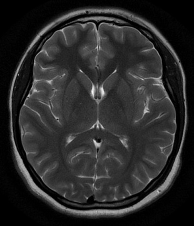

<a name="readme-top"></a>

<!-- PROJECT SHIELDS -->

[![Contributors][contributors-shield]][contributors-url]
[![Forks][forks-shield]][forks-url]
[![Stargazers][stars-shield]][stars-url]
[![Issues][issues-shield]][issues-url]
[![MIT License][license-shield]][license-url]
[![LinkedIn][linkedin-shield]][linkedin-url]
[![Made with love in SUT (Iran)][sut-badge]][sut-add]


<!-- PROJECT LOGO -->
<br />
<div align="center">
  <a href="https://github.com/Sad-Abd/qtreemesh">
    
  </a>

<h3 align="center">QTREEMESH</h3>

  <p align="center">
    Generation of QuadTree mesh from an image
    <br />
    <a href="https://github.com/Sad-Abd/qtreemesh"><strong>Explore the docs »</strong></a>
    <br />
    <br />
    <a href="https://github.com/Sad-Abd/qtreemesh">View Demo</a>
    ·
    <a href="https://github.com/Sad-Abd/qtreemesh/issues">Report Bug</a>
    ·
    <a href="https://github.com/Sad-Abd/qtreemesh/issues">Request Feature</a>
  </p>
</div>


<!-- TABLE OF CONTENTS -->
<details>
  <summary>Table of Contents</summary>
  <ol>
    <li>
      <a href="#about-the-project">About The Project</a>
    </li>
    <li>
      <a href="#getting-started">Getting Started</a>
      <ul>
        <li><a href="#installation">Installation</a></li>
      </ul>
    </li>
    <li><a href="#usage">Usage</a>
      <ol>
        <li><a href="#1.-read-image">Read Image</a></li>
        <li><a href="#2.-preprocessing">Preprocessing</a></li>
        <li><a href="#3.-quadTree-algorithm">QuadTree Algorithm</a></li>
        <li><a href="#4.-mesh-generation">Mesh Generation</a></li>
      </ol>
    </li>
    <li><a href="#theoretical-explanation">Theoretical Explanation</a></li>
    <li><a href="#roadmap">Roadmap</a></li>
    <li><a href="#contributing">Contributing</a></li>
    <li><a href="#license">License</a></li>
    <li><a href="#contact">Contact</a></li>
    <li><a href="#acknowledgments">Acknowledgments</a></li>
  </ol>
</details>


<!-- ABOUT THE PROJECT -->
## About The Project

<!--[![Product Name Screen Shot][product-screenshot]](https://example.com)-->

QTREEMESH is a python package that can create a [Quadtree](https://en.wikipedia.org/wiki/Quadtree) structure from an image. This tree data structure can also be converted to mesh structure that can be used in different areas of science, e.g. finite element analysis. The Quadtree algorithm in this package is based on pixels' intensity. For more information about this algorithm, please refer to <a href="#theoretical-explanation">Theoretical Explanation</a> section of this doc.


<p align="right">(<a href="#readme-top">back to top</a>)</p>


<!--
### Built With

[![python][python]](https://www.python.org)

<p align="right">(<a href="#readme-top">back to top</a>)</p>
-->


<!-- GETTING STARTED -->
## Getting Started

This part explains how to install and use this package.

### Installation
Install `QTREEMESH` from PyPI via pip.
```sh
pip install qtreemesh
```


<p align="right">(<a href="#readme-top">back to top</a>)</p>


<!-- USAGE EXAMPLES -->
## Usage

There is a `test.py` file in `examples` folder that demonstrate how different parts of this package work. Here we go through this file line by line:

### 1. Read Image

First we import required tools from other libraries
```python
from PIL import Image # to read image file properly
from numpy import asarray # for converting image matrix to array
```

Then we read the image and convert it to gray-scale. There are three example images in `examples` folder. `4.jpg` is smaller than the two others and need fewer computation efforts.
```python
im = Image.open("4.jpg").convert('L')
```

### 2. Preprocessing

The quadtree algorithm is most efficient when the image is square and the number of its pixels is an integer power of 2, i.e. $2^n$. There is a function `image_preprocess()` dedicated to the modification of the original image by padding it with zero intensity pixels and satisfying the mentioned requirement:
```python
from qtreemesh import image_preprocess

imar = image_preprocess(asarray(im))
```

### 3. QuadTree Algorithm

The QuadTree decomposition can be performed on `image_array` using a recursive class `QTree` based on given `tolerance`.
```python
from qtreemesh import QTree

quad = QTree(None, imar, 125) # QTree(None, image_array, tolerance)
```

`QTree` object may have 4 children `QTree` objects (can be accessed through attributes: `north_west`,
`north_east`,
`south_west`,
`south_east`) and so on. Each `QTree` has an attribute `divided` that determines the existence of children partitions. There are also an property method for counting `count_leaves` and a method for saving tree leaves `save_leaves` (i.e. undivided partitions).

### 4. Mesh Generation
Common mesh data structure can be extracted from QuadTree structure using `QTreeMesh` class. After initiating the class, corresponding `elements` and `nodes` can be generated as attributes of the `QTreeMesh` object with the method `create_elements`. The resulted mesh may be illustrated using `draw` method. 
```python
from qtreemesh import QTreeMesh

mesh = QTreeMesh(quad)
mesh.create_elements()
mesh.draw(True, 'orangered') # mesh.draw(fill_inside, edge_color, save_name)
```

Each element in `elements` is a `QTreeElement` object that contains many attributes, e.g. element number : `number`, element nodes : `nodes_numbers`, element property (average of pixel intensities) : `element_property` and etc.

| Example   |      Image      |  Mesh |
|----------|:-------------:|:------:|
| 4.jpg |   |  |
| 5.jpg |       |    |

One can easily export generated mesh as `vtk` format using following line:
```python
mesh.vtk_export(filename = "4_meshed.vtk")
```
and the result can be viewed in visualization applications such as [ParaView](https://github.com/Kitware/ParaView):


It's worth mentioning that the method `vtk_export()` has no dependency to vtk related libraries and create `.vtk` file manually.

_For more examples, please refer to the [Documentation](https://example.com)_

<p align="right">(<a href="#readme-top">back to top</a>)</p>

## Theoretical Explanation

### Introduction

A __Quadtree__ is a special type of tree where each parent node has exactly four smaller nodes connected to it. Each square in the Quadtree is represented by a node. If a node has children, their squares are the four quadrants of its own square, which is why the tree is called a tree. This means that when you put the smaller squares of the leaves together, they make up the bigger square of the root. 


In this figure, labels _NW_, _NE_, _SE_, and _SW_ are representing different quadrants (North-West, North-East, South-East and South-West respectively).

While this algorithm has many applications in various fields of science (e.g., collision detection, image compression, etc.), this doc especially focuses on the mesh generation subject. There almost three major definition of problem:

1. **Points set problems:**

    In this case, there are a set of points $\{p_i\} : (x_i , y_i)$ (which can be interpreted as the position of objects), and we need to build the quadtree in such a way that every square contains at most $c$ point(s). First we consider the root square which contains all the points. Then we start recursively splitting squares until the criteria $n_p \le c$ met. In following figure, the quadtree of 11 points with $c = 1$ is illustrated:

    

    There are many different implementations of this variation of algorithm, for example in [Python](https://www.geeksforgeeks.org/quad-tree/), 
    [C++](https://lisyarus.github.io/blog/programming/2022/12/21/quadtrees.html), and 
    [C#](https://github.com/justcoding121/Advanced-Algorithms/blob/develop/src/Advanced.Algorithms/DataStructures/Tree/QuadTree.cs).

2. **Domain boundary problems:**
    
    This type of problem is very common in mesh generation for CAD models. The domain of interest is defined by some lines that usually separate inside of the domain from outside of it. A common approach is to generate *seed points* on the boundary and create a quadtree just the same as points set problems. There will be some additional steps to convert quadtree to FEM mesh, such as removing the outside squares and trimming of boundary squares. The following figure illustrate quadtree of a circular domain 
    [Ref](https://www.researchgate.net/publication/354207606_Solving_incompressible_Navier--Stokes_equations_on_irregular_domains_and_quadtrees_by_monolithic_approach).

    
    
    
3. **Digital images problems:**

    The quadtree decomposition of an image means dividing the image into squares with the same color (within a given threshold). Considering an image consisting of $2^n × 2^n$ pixels, the algorithm recursively split the image into four quadrants until the difference between the maximum and minimum pixels intensities becomes less than the specified tolerance. 

    The current package is dedicated to these types of problems.


### References
* de Berg, M., Cheong, O., van Kreveld, M., & Overmars, M. (2008). Computational geometry: Algorithms and applications. In Computational Geometry: Algorithms and Applications. Springer Berlin Heidelberg. https://doi.org/10.1007/978-3-540-77974-2
* Lo, D.S.H. (2015). Finite Element Mesh Generation (1st ed.). CRC Press. https://doi.org/10.1201/b17713
* Frey, Pascal & George, Paul. (2008). Mesh Generation: Application to Finite Elements: Second Edition. Mesh Generation: Application to Finite Elements: Second Edition. https://doi.org/10.1002/9780470611166. 


<!-- ROADMAP -->
## Roadmap

- [x] Completing the codes documentation
- [ ] Adding details to README file
- [x] Exporting data as `vtk` format
- [ ] Successfully implement in FEM software
  - [ ] Handling hanging nodes
  - [ ] Prepare required data
  - [ ] Illustrate usage in open-source FEM programs
- [ ] Prepare required data for SBFEM


See the [open issues](https://github.com/Sad-Abd/qtreemesh/issues) for a full list of proposed features (and known issues).

<p align="right">(<a href="#readme-top">back to top</a>)</p>


<!-- CONTRIBUTING -->
## Contributing

Contributions are what make the open source community such an amazing place to learn, inspire, and create. Any contributions you make are **greatly appreciated**.

If you have a suggestion that would make this better, please fork the repo and create a pull request. You can also simply open an issue with the tag "enhancement".
Don't forget to give the project a star! Thanks again!


<p align="right">(<a href="#readme-top">back to top</a>)</p>


<!-- LICENSE -->
## License

Distributed under the MIT License. See `LICENSE.txt` for more information.

<p align="right">(<a href="#readme-top">back to top</a>)</p>


<!-- CONTACT -->
## Contact

Sadjad Abedi -  AbediSadjad@gmail.com

Project Link: [https://github.com/Sad-Abd/qtreemesh](https://github.com/Sad-Abd/qtreemesh)

<p align="right">(<a href="#readme-top">back to top</a>)</p>


<!-- ACKNOWLEDGMENTS -->
## Acknowledgments

* []()
* []()
* []()

<p align="right">(<a href="#readme-top">back to top</a>)</p>


<!-- MARKDOWN LINKS & IMAGES -->
<!-- https://www.markdownguide.org/basic-syntax/#reference-style-links -->
[contributors-shield]: https://img.shields.io/github/contributors/Sad-Abd/qtreemesh.svg?style=for-the-badge
[contributors-url]: https://github.com/Sad-Abd/qtreemesh/graphs/contributors
[forks-shield]: https://img.shields.io/github/forks/Sad-Abd/qtreemesh.svg?style=for-the-badge
[forks-url]: https://github.com/Sad-Abd/qtreemesh/network/members
[stars-shield]: https://img.shields.io/github/stars/Sad-Abd/qtreemesh.svg?style=for-the-badge
[stars-url]: https://github.com/Sad-Abd/qtreemesh/stargazers
[issues-shield]: https://img.shields.io/github/issues/Sad-Abd/qtreemesh.svg?style=for-the-badge
[issues-url]: https://github.com/Sad-Abd/qtreemesh/issues
[license-shield]: https://img.shields.io/github/license/Sad-Abd/qtreemesh.svg?style=for-the-badge
[license-url]: https://github.com/Sad-Abd/qtreemesh/blob/master/LICENSE.txt
[linkedin-shield]: https://img.shields.io/badge/-LinkedIn-black.svg?style=for-the-badge&logo=linkedin&colorB=555
[linkedin-url]: https://linkedin.com/in/seyed-sadjad-abedi-shahri
[product-screenshot]: images/screenshot.png
[python]: https://www.python.org/static/community_logos/python-logo.png
[sut-add]: https://sut.ac.ir
[sut-badge]: https://img.shields.io/badge/Made%20with%20%E2%9D%A4%EF%B8%8F%20in-SUT%20(Iran)-0c674a?style=for-the-badge
